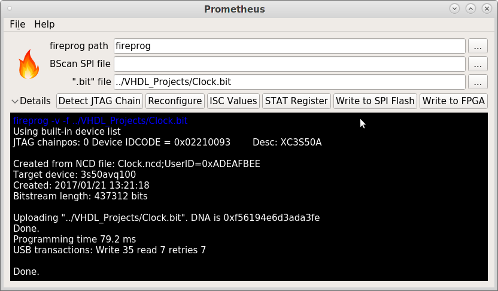
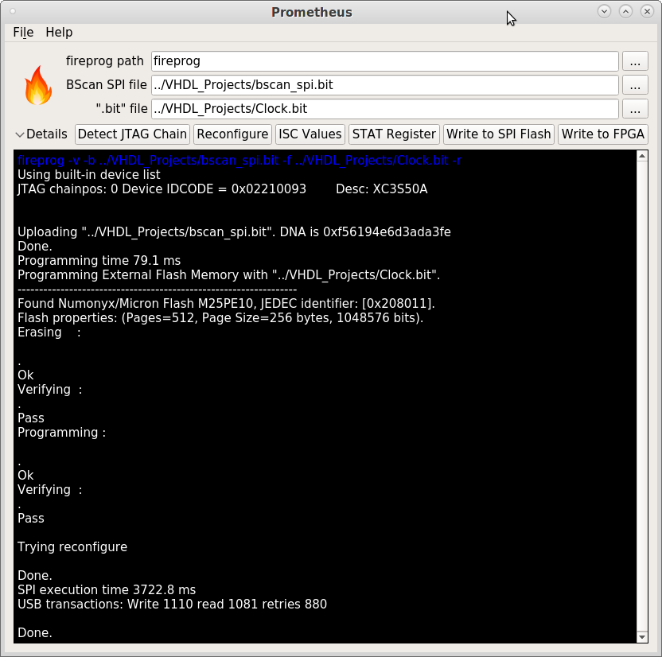

# Prometheus: a QT-based GUI for fireprog(.exe)

Prometheus is a GUI program which facilitates using a Xilinx Spartan 3 configuration tool "fireprog(.exe)" by setting proper program arguments.

## Compilation on Linux
To compile for Linux, run:

     make Prometheus_Linux

## Cross-compilation on Linux for Windows
To cross-compile for Windows on Linux using MXE (a cross-compilation environment based on MinGW), run:

     make Prometheus_MinGW32.exe
     make Prometheus_MinGW64.exe

Assumption is that MXE is located in "/opt/mxe/" folder. Compiled executables will be stored in the "release" directory.

## List of files
	|---------------------+--------------------------------------------|
	| Name                | Comment                                    |
	|---------------------+--------------------------------------------|
	| Images/             | Images for resource file  *.qrc            |
	| main.cpp            | main.cpp just calls MainWindow.cpp         |
	| MainWindow.cpp      | All functions are here                     |
	| MainWindow.h        | Header file for MainWindow.cpp             |
	| MainWindow.ui       | XML with QT4 layout                        |
	| Makefile            | Makefile to compile *.pro files            |
	| Prometheus.manifest | Windows specific manifest, appended to EXE |
	| Prometheus.rc       | Windows specific resource file             |
	| README              | This file                                  |
	| Resources.qrc       | QT4 resource file                          |
	|---------------------+--------------------------------------------|

## Usage
Configuring FPGA with a bit-stream:

Configuring SPI flash with a bit-stream:

Copyleft (C) 2017 Altynbek Isabekov, Onurhan Öztürk

Prometheus is based on "miniSProg" project of Fahad Alduraibi.

Prometheus is free software: you can redistribute it and/or modify
it under the terms of the GNU General Public License as published by
the Free Software Foundation, either version 3 of the License, or
(at your option) any later version.

Prometheus is distributed in the hope that it will be useful,
but WITHOUT ANY WARRANTY; without even the implied warranty of
MERCHANTABILITY or FITNESS FOR A PARTICULAR PURPOSE.  See the
GNU General Public License for more details.
